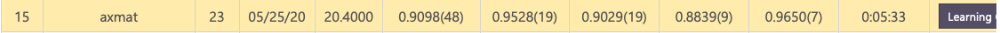

Our solution for [KDD Cup AutoGraph Challenge](https://www.4paradigm.com/competition/kddcup2020)

## Training
We used an ensemble method of Graph Convultional Network, ARMA, Gated Graph Convultion, Simple GCN, Graph SAGE, Graph Attention Network, Higher-Order GNN and Topology Adaptive GCN.

## Leaderboard
### Feedback phase (15th/144)

### Final phase (22th/42)
